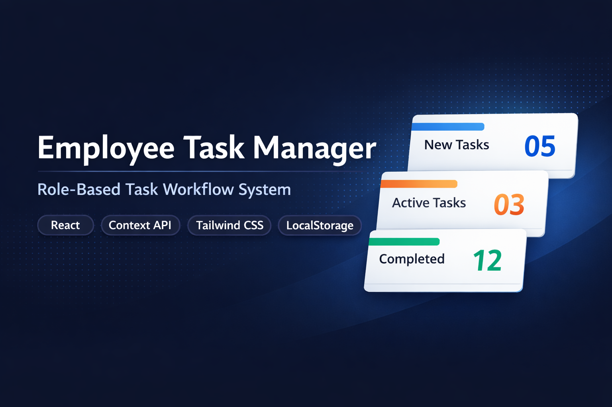
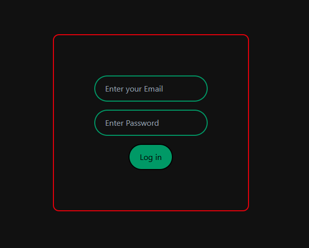
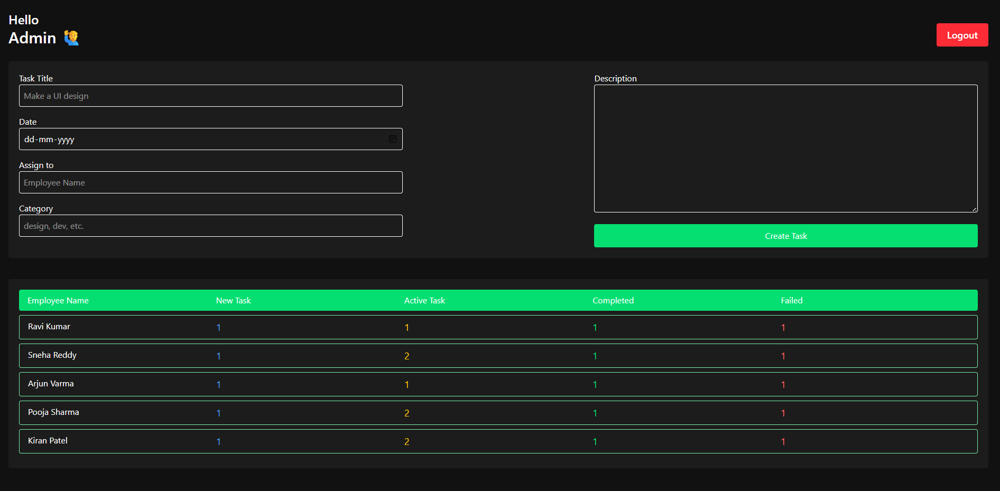
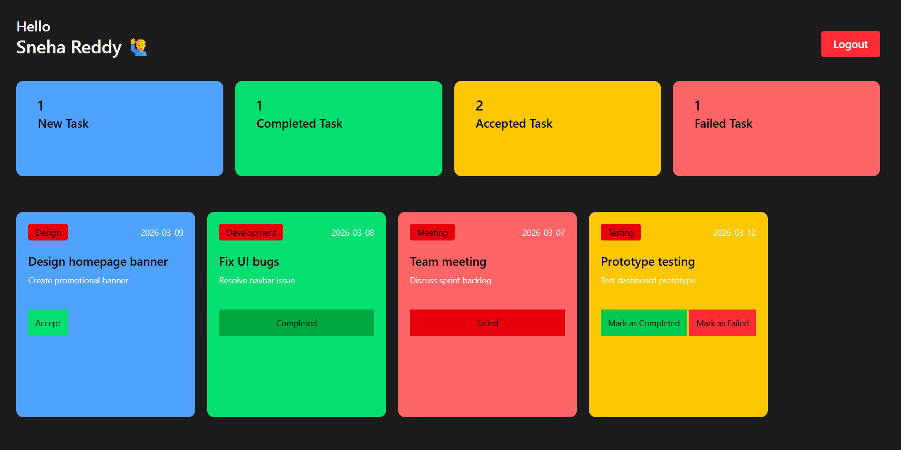

# 🧑‍💼 Employee Management System



A role-based task management web application built using **React** where an Admin can assign tasks to employees and employees can manage their task workflow including accepting, completing, and failing tasks.

This project demonstrates real-world frontend architecture patterns such as global state management using Context API, immutable nested updates, and persistent authentication using LocalStorage.

---

## 🌐 Live Demo
https://pratham29es11.github.io/employee-management-react/
---

## 🚀 Core Features

### 🔐 Authentication & Roles

- Admin Login
- Employee Login
- Persistent Session using LocalStorage
- Role-based Dashboard Rendering

### 📋 Task Management Workflow

- Admin can assign tasks to employees
- Employees can:
  - Accept Tasks
  - Mark Tasks as Completed
  - Mark Tasks as Failed

- Task Status Counters auto update

### ⚡ State Management

- Global State using React Context API
- Immutable updates for deeply nested structures
- Real-time UI sync without refresh
- Derived state pattern (no stale snapshots)

---

## 🧠 Architecture Overview

```
AuthProvider (Global State)
        │
        ├── Admin Dashboard
        │       └── Create Task
        │
        └── Employee Dashboard
                └── TaskList
                        └── TaskCard Actions
```

### State Flow

```
Task Action → Context Update → Re-render Dashboard → UI Sync
```

---

## 🛠️ Tech Stack

- React JS
- JavaScript (ES6+)
- Context API
- Tailwind CSS
- LocalStorage

---

## 📂 Folder Structure

```
src/
 ├── components/
 │    ├── Auth/
 │    ├── Dashboard/
 │    ├── Tasks/
 │    ├── Admin/
 │
 ├── context/
 │    ├── AuthProvider.jsx
 │
 ├── utils/
 │    ├── storageHelpers.js
 │
 ├── App.jsx
 ├── main.jsx
```

---

## 📸 Screenshots





---

## ⚙️ Run Locally

Clone the project

```
git clone https://github.com/pratham29es11/Employee-Management.git
```

Go to directory

```
cd Employee-Management
```

Install dependencies

```
npm install
```

Run project

```
npm run dev
```

---

## 🔑 Demo Credentials

Admin:

```
email: admin@example.com
password: 123
```

Employee:

```
email: employee1@example.com
password: 123
```

---

## 🧠 Engineering Challenges Solved

- Updating deeply nested task arrays without mutating state
- Preventing stale UI by deriving logged user data from context
- Synchronizing Context state with LocalStorage persistence
- Managing task lifecycle transitions with accurate counters
- Handling deterministic updates using unique task identifiers

---

## 🔮 Future Improvements

- Backend Integration (Node.js / Firebase / Express)
- Authentication
- Protected Routes (React Router)
- useReducer based task engine
- React Redux for State Management
- Database persistence (MongoDB / MySQL)
- Notifications system
- Optimistic UI Updates
- Team / Department level permissions

---

## 👨‍💻 Author

Pratham Kalyan Yarlagadda

GitHub → https://github.com/pratham29es11
LinkedIn → https://linkedin.com/in/pratham-kalyan
